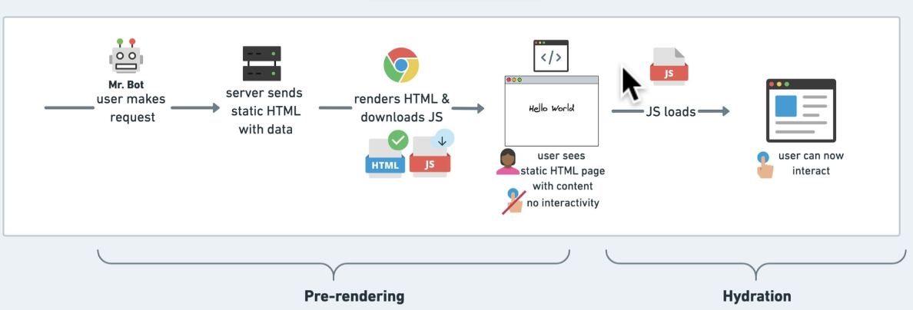

## Next.js

### Different Rendering Techniques

- Server Side Rendering (SSR): Generate page on the server (fresh data on every request - user-specific content, etc.)
- Static Site Generation (SSG): Generate page at build time (pre-built and cached - blog posts, product pages, etc.)
- Incremental Site Regeneration (ISR): Best of both worlds (pre-built and cached, but can be updated - requires more configration)

### Next.js Features

- Performance: Automatic code splitting, minifying files, image optimization, pre-fetching assests, etc.
- Image Optimization: Determine the best format, size, and device to serve images to
- File Based Routing: Create routes by creating files (before version 13.x, you had to use a `pages` folder)

### API folder (serverless functions)

- Anything in the api folder will be automatically routed to `/api` (e.g. `/api/products` will be routed to `http://localhost:3000/api/products`)
- It is not bundled with the client code. It is only available on the server side.
- For each request to a serverless function a new node server is **created** and **destroyed** after the request is completed.

### No more Babel

- Next.js no longer uses Babel but SWC (Rust-based compiler)
- SWC is faster than Babel

### HMR connection now uses WebSocket

- Before version 11.x, HMR connection used HTTP polling
- Now it uses WebSocket
- HMR (Hot Module Replacement) is a feature that allows you to update your code while the application is running, without a full reload
- HMR is common among tools like Webpack, Parcel, etc.

### Middleware

- Middleware runs before cached content and routes are matched
- Use the file middleware.ts (or .js) in the root of your project to define Middleware
- Middleware will be invoked for every route.
- The order is: headers, redirects, Middleware, Filesystem routes, Dynamic routes then fallbacks

### File/folder structure

- package.json: Contains all the dependencies and scripts
- pages: Default Routing
- pages/api: Serverless functions
- pages/_app.js: entry point - provides a wrapper for all pages
- pages/index.js: default route
- public: all static assets

### Routing

- Has index routes (e.g. `/about` and `/about/index` are the same)
- Case sensitive (e.g. `/About` and `/about` are different)
- Is file based (e.g. `/about` will look for `pages/about.js`)
- Dynamic routes (e.g. `/products/1` will look for `pages/products/[id].js`)

### Dynamic Routes

- Dynamic routes are defined by adding square brackets to the file name (e.g. `[id].js`)
- Dynamic routes can be nested (e.g. `pages/products/[category]/[id].js`)
- The [] is called a slug which is a placeholder for the actual value. (e.g. `pages/products/[category]/[id].js` will match `/products/shoes/1` and `/products/shirts/2`)

### Pre-rendering

- By default, Next.js pre-renders every page

